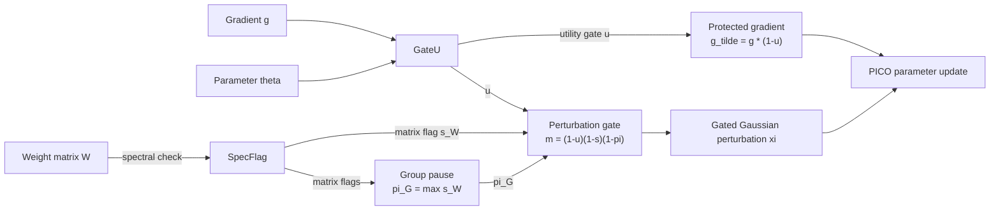

# Plasticity without Collapse

## PICO: Plasticity-Inducing Control Optimizer for Cross-Lingual Continual Pre-Training

> An optimizer-level method for continual pre-training that protects important parameters while allowing safe stochastic exploration.

---

## TL;DR

**PICO** balances plasticity and stability by protecting high-utility parameters and injecting exploration noise only when utility and spectral signals indicate that perturbation is safe.

---

## The Idea

Continual pre-training requires a model to adapt to new languages and domains without destroying previously learned capabilities.

PICO addresses this problem using two complementary mechanisms:

| Component             | Scope                | Role                                                                                            |
| --------------------- | -------------------- | ----------------------------------------------------------------------------------------------- |
| **GateU**             | Parameter coordinate | Estimates parameter utility and attenuates updates to high-utility coordinates                  |
| **SpecFlag**          | Weight matrix        | Detects abrupt spectral changes and suppresses perturbation when structural sensitivity is high |
| **Group pause** (\pi) | Parameter group      | Propagates a matrix-level spectral warning across its parameter group                           |

GateU produces a coordinate-wise utility gate (u). The gradient is protected as

```text
g_tilde = g * (1 - u)
```

For two-dimensional weight matrices, SpecFlag periodically monitors spectral statistics, including the leading singular value and spectral concentration.

The group-level pause is derived from the matrix-level spectral flags:

```text
pi_G = max(s_W for W in G)
```

The utility gate, matrix-level spectral flag, and group-level pause determine where stochastic perturbation is allowed:

```text
m = (1 - u) * (1 - s) * (1 - pi)
```

The perturbation is then sampled from a gated Gaussian distribution:

```text
xi ~ N(0, diag((sigma_0 * m)^2))
```

The protected gradient and gated perturbation are jointly applied by the optimizer.

### Control Flow



The hierarchy is important:

* **GateU affects both optimization and exploration.** High-utility coordinates receive a smaller gradient update and less perturbation.
* **SpecFlag affects exploration only.** A spectral warning suppresses stochastic perturbation but does not freeze the protected-gradient update.
* **The group pause is not an independent detector.** It is derived from matrix-level SpecFlag decisions and propagates structural caution across a predefined parameter group.

---

## Why a New Metric?

Average continual-learning metrics can hide severe degradation in a single domain when the remaining domains stay stable.

They also measure forgetting using absolute differences, which can be difficult to compare when language-model metrics operate on different numerical scales.

We therefore introduce **WCR (Worst Collapse Ratio)**, a normalized worst-domain retention metric.

For a non-negative, higher-is-better metric (\mu), let

```text
R[t, i]
```

denote performance on domain (i) after continual-training stage (t).

The reference performance for domain (i) is its best score after that domain has entered the training stream:

```text
R_star[i] = max R[t, i], for t = i, ..., T
```

The pre-CPT baseline is excluded so that the reference reflects capability attained after the domain has been learned.

The relative collapse of domain (i) is

```text
1 - R[T, i] / R_star[i]
```

and WCR is the maximum collapse across all learned domains:

```text
WCR = max_i (1 - R[T, i] / R_star[i])
```

Thus, WCR answers a simple question:

> **Did any previously learned domain suffer a severe relative collapse?**

A low average forgetting score is not sufficient if one domain has degraded substantially. WCR exposes that worst-domain failure directly.

**Lower WCR is better.**

WCR is intended for non-negative, higher-is-better metrics such as BLEU and ROUGE-L. It is not directly applied to lower-is-better quantities such as loss or perplexity.

---

## Evaluation Metrics

The evaluation pipeline reports the following text-generation metrics:

* BLEU
* ROUGE-1
* ROUGE-2
* ROUGE-L
* METEOR
* Cosine Similarity
* Token Precision
* Token Recall
* Token F1

For each supported higher-is-better metric, continual-learning behavior is summarized using:

* **FWT** — Forward Transfer
* **BWT** — Backward Transfer
* **AvgF** — Average Forgetting
* **WCR** — Worst Collapse Ratio

---

## Repository Structure

```text
eval/
├── run_cl_eval.py
└── modules/
    ├── cl_evaluator.py
    ├── eval_stability.py
    └── metrics.py
```

`metrics.py` contains the text-quality metrics and the FWT, BWT, AvgF, and WCR calculations.

---

## Quick Start

PICO follows the standard optimizer interface and does not require changes to the model architecture.

```python
from optim import PICO

optimizer = PICO(
    model.parameters(),
    lr=2e-5,
    sigma0=0.01,
    f=10,
)

for batch in dataloader:
    loss = model(batch).loss
    loss.backward()

    optimizer.step()
    optimizer.zero_grad()
```

Adjust the import path and optimizer arguments to match the released repository configuration.

---

## Evaluation

Run continual-learning evaluation through the evaluation entry point:

```bash
python eval/run_cl_eval.py [arguments]
```

The evaluator constructs the stage-by-domain performance matrix and computes continual-learning metrics for the supported text-generation measures.

Exact experiment commands and configurations should follow the released configuration files.

---

## Scope

The current study focuses on cross-lingual continual pre-training across the languages, domains, curricula, and model scales evaluated in the paper.

Results should not be interpreted as evidence that the same behavior necessarily generalizes to arbitrary continual-learning settings.

---

## Citation

Citation information will be updated upon publication.

```bibtex
@misc{pico2026,
  title  = {Plasticity without Collapse: Plasticity-Inducing Control Optimizer for Cross-Lingual Continual Pre-Training},
  author = {TBD},
  year   = {2026}
}
```

---

## License

TBD

## Acknowledgements

TBD
