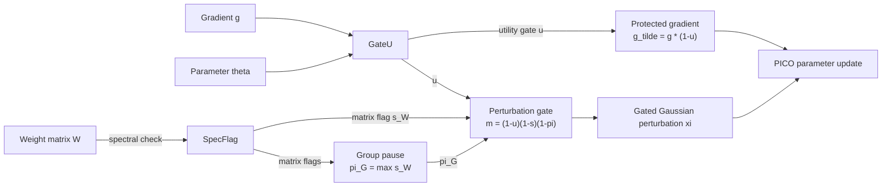

# Plasticity without Collapse

## PICO: Plasticity-Inducing Control Optimizer for Cross-Lingual Continual Pre-Training

> An optimizer-level method for continual pre-training that protects important parameters while allowing safe stochastic exploration.

---

## TL;DR

**PICO** balances plasticity and stability by protecting high-utility parameters and injecting exploration noise only when utility and spectral signals indicate that perturbation is safe.

---

## The Idea

Continual pre-training requires a model to adapt to new languages and domains without destroying previously learned capabilities.

PICO addresses this problem using two complementary mechanisms:

| Component             | Scope                | Role                                                                                            |
| --------------------- | -------------------- | ----------------------------------------------------------------------------------------------- |
| **GateU**             | Parameter coordinate | Estimates parameter utility and attenuates updates to high-utility coordinates                  |
| **SpecFlag**          | Weight matrix        | Detects abrupt spectral changes and suppresses perturbation when structural sensitivity is high |
| **Group pause** (\pi) | Parameter group      | Propagates a matrix-level spectral warning across its parameter group                           |

GateU produces a coordinate-wise utility gate (u). The gradient is protected as

```text
g_tilde = g * (1 - u)
```

For two-dimensional weight matrices, SpecFlag periodically monitors spectral statistics, including the leading singular value and spectral concentration.

The group-level pause is derived from the matrix-level spectral flags:

```text
pi_G = max(s_W for W in G)
```

The utility gate, matrix-level spectral flag, and group-level pause determine where stochastic perturbation is allowed:

```text
m = (1 - u) * (1 - s) * (1 - pi)
```

The perturbation is then sampled from a gated Gaussian distribution:

```text
xi ~ N(0, diag((sigma_0 * m)^2))
```

The protected gradient and gated perturbation are jointly applied by the optimizer.

### Control Flow



The hierarchy is important:

* **GateU affects both optimization and exploration.** High-utility coordinates receive a smaller gradient update and less perturbation.
* **SpecFlag affects exploration only.** A spectral warning suppresses stochastic perturbation but does not freeze the protected-gradient update.
* **The group pause is not an independent detector.** It is derived from matrix-level SpecFlag decisions and propagates structural caution across a predefined parameter group.

---

## Why a New Metric?

Average continual-learning metrics can hide severe degradation in a single domain when the remaining domains stay stable.

They also measure forgetting using absolute differences, which can be difficult to compare when language-model metrics operate on different numerical scales.

We therefore introduce **WCR (Worst Collapse Ratio)**, a normalized worst-domain retention metric.

For a non-negative, higher-is-better metric (\mu), let

```text
R[t, i]
```

denote performance on domain (i) after continual-training stage (t).

The reference performance for domain (i) is its best score after that domain has entered the training stream:

```text
R_star[i] = max R[t, i], for t = i, ..., T
```

The pre-CPT baseline is excluded so that the reference reflects capability attained after the domain has been learned.

The relative collapse of domain (i) is

```text
1 - R[T, i] / R_star[i]
```

and WCR is the maximum collapse across all learned domains:

```text
WCR = max_i (1 - R[T, i] / R_star[i])
```

Thus, WCR answers a simple question:

> **Did any previously learned domain suffer a severe relative collapse?**

A low average forgetting score is not sufficient if one domain has degraded substantially. WCR exposes that worst-domain failure directly.

**Lower WCR is better.**

WCR is intended for non-negative, higher-is-better metrics such as BLEU and ROUGE-L. It is not directly applied to lower-is-better quantities such as loss or perplexity.

---

## Evaluation Metrics

The paper reports five text-generation metrics: ROUGE-L, BLEU, METEOR, cosine similarity, and Token F1.

The evaluation pipeline additionally computes chrF, ROUGE-1, ROUGE-2, token precision, and token recall as diagnostics.

For each supported higher-is-better metric, continual-learning behavior is summarized using:

* **FWT** — Forward Transfer
* **BWT** — Backward Transfer
* **AvgF** — Average Forgetting
* **WCR** — Worst Collapse Ratio

---

## Repository Structure

```text
cp4llm/
├── train_cpt.py            one training entry point for PICO and all baselines
├── train/
│   ├── common.py           shared loop, data pipeline, seeding, checkpointing
│   └── methods.py          PICO + 9 baselines as hook subclasses
├── optimizer/PICO.py       the optimizer
├── eval/
│   ├── run_cl_eval.py      continual-learning evaluation entry point
│   ├── cl_metrics.py       FWT / BWT / AvgF / CR / WCR from cl_summary.json
│   └── modules/            evaluator, generation runner, text metrics
└── utils/                  dataset loader, frozen evaluation manifests
scripts/
├── env.sh                  shared conditions, one place for every method
├── train.sh                method x {777, 911, 4041} training
├── eval.sh                 evaluation with auto-built curriculum
└── run_all.sh              train then evaluate, one command
```

---

## Quick Start

PICO follows the standard optimizer interface and does not require changes to the model architecture.

```python
from optimizer.PICO import PICO

optimizer = PICO(
    model.parameters(),
    lr=2e-5,
    weight_decay=0.01,
    beta_utility=0.999,
    sigma=0.001,                # sigma_0, camera-ready audited value
    spectral_update_freq=1,     # f = 1 main; f = 10 for the scaling study
    power_iterations=1,         # K
)

for batch in dataloader:
    loss = model(**batch).loss
    loss.backward()
    optimizer.step()
    optimizer.zero_grad()
```

---

## Reproduction

```bash
python -m venv .venv && source .venv/bin/activate
pip install -r requirements.txt      # frozen experiment environment + repo extras
accelerate config                    # choose MULTI_GPU (DDP); FSDP is rejected
export HF_TOKEN=hf_xxx               # corpus repo access

# Korean Medical combines material from AI Hub datasets 71487 (v1.2)
# and 110 (v1.1) and cannot be redistributed. Obtain them yourself, then:
export KOR_MEDICAL_PATH=/data/aihub71487/new-medical-kor-dataset.txt

bash scripts/run_all.sh pico         # PICO x seeds {777, 911, 4041}, train + eval
bash scripts/run_all.sh all          # every method, method-outer seed-inner
MODEL_SIZE=3b bash scripts/run_all.sh pico   # Llama-3.2-3B-Instruct
MODEL_SIZE=8b bash scripts/run_all.sh pico   # Llama-3.1-8B-Instruct, balanced device map
```

PICO runs with `f = 1` at every scale, matching the primary configuration
reported in the paper.

Evaluation builds the four-stage curriculum from the checkpoints that training
actually wrote and additionally probes `math` (GSM8K) as the evaluation-only
out-of-domain benchmark. See `TRAINING.md` for the full unified-condition
table, per-method hyperparameters, and everything that was changed relative to
the original per-method scripts.

---

## Scope

The current study focuses on cross-lingual continual pre-training across the languages, domains, curricula, and model scales evaluated in the paper.

Results should not be interpreted as evidence that the same behavior necessarily generalizes to arbitrary continual-learning settings.

---

## Citation

The paper is not yet published. Please cite the preprint form below. This
entry will be replaced with the official venue BibTeX upon publication.

```bibtex
@misc{kim2026pico,
  title  = {Plasticity without Collapse: Plasticity-Inducing Control
            Optimizer for Cross-Lingual Continual Pre-Training},
  author = {Kim, Sumin and Song, Minjun and Lee, Surin and
            Wahidur, Rahman S M and Lee, Yongtae and Choi, Haeung and
            Lee, Heung-No},
  year   = {2026}
}
```

---

## License

Code is released under the MIT License (see `LICENSE`). Corpus text is not
part of this repository. Each corpus follows its upstream terms as documented
in `TRAINING.md` and the paper's data appendix. The Korean Medical sources
are products of the Korean Ministry of Science and ICT intelligent
information industry infrastructure program administered by the National
Information Society Agency, and are obtained directly from AI Hub under its
terms.
